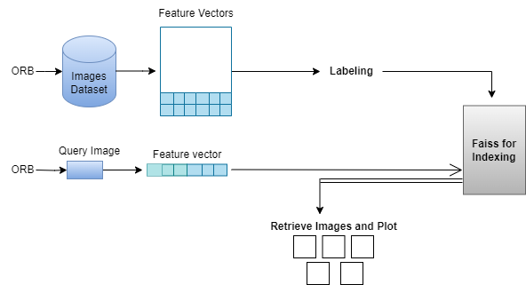

# CBIR (Content Based Image Retrieval)

## Image retrieval methods
- Image retrieval is the process of finding images that match a given query, such as a keyword, a text description, or another image. 
- There are two main methods for image retrieval:\
 `text-based and content-based.` 
- Text-based image retrieval relies on metadata, such as captions, tags, or filenames, to describe the images. 
- Content-based image retrieval uses features, such as color, texture, shape, or deep learning models, to represent the images.

## Content-Based Image Retrieval:
- CBIR is a technique used to retrieve images from a database based on their visual content rather than relying on textual annotations or metadata. 
- CBIR systems analyze the visual features of images, such as color, texture, shape, and spatial arrangement, to find images that are similar to a given query image.
- Content-based image retrieval appears to overcome the disadvantages of the text-based image retrieval methods (searching image databases through the use of Keywords). 
- Text-based image retrieval suffers from many disadvantages:\
           1) manually annotating large databases is not feasible\
           2) subject to human perception,\
           3) these annotations are applicable for only one language.

## Block diagram of CBIR system:

